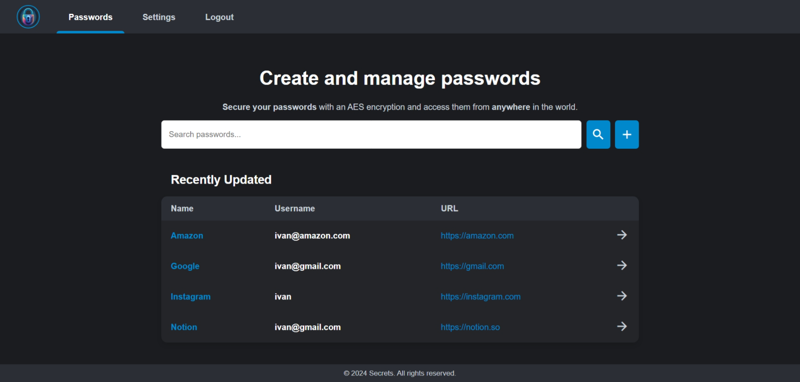
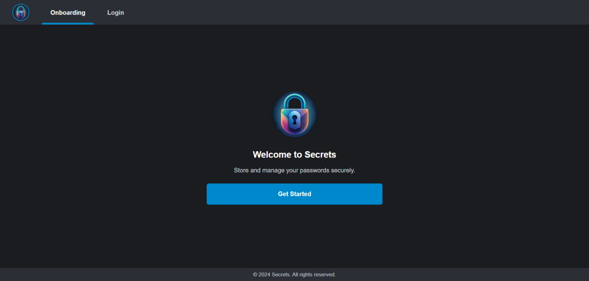
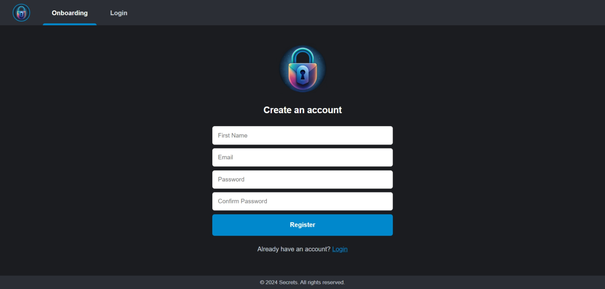

# Secrets Frontend


Simple self-hosted password manager.



---

**Backend:** https://github.com/everysoftware/secrets-backend

**Frontend:** https://github.com/everysoftware/secrets-frontend

---

## Features

* Create and manage your passwords from anywhere in the world
* Search passwords easily by name or URL
* Protect your passwords with AES encryption

## Stack

HTML • CSS • JS • Jinja2 • Python 3.12 • FastAPI

## Installation

1. Clone the repository:

    ```bash
    git clone https://github.com/everysoftware/secrets-frontend
    ```
2. Create `.env` file based on `.env.example`:

    ```bash
    cp .env.example .env
    ```

3. Run the application:

   ```bash
      make up
   ```

## Screenshots





