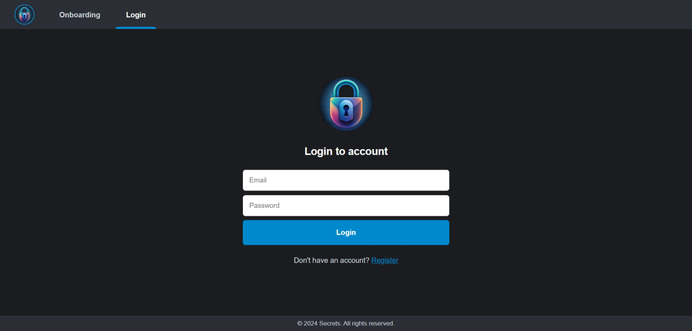
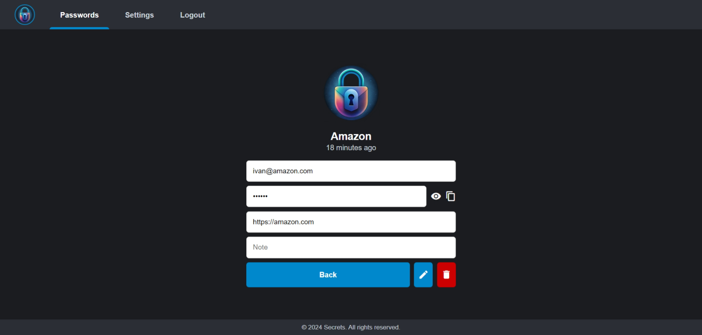
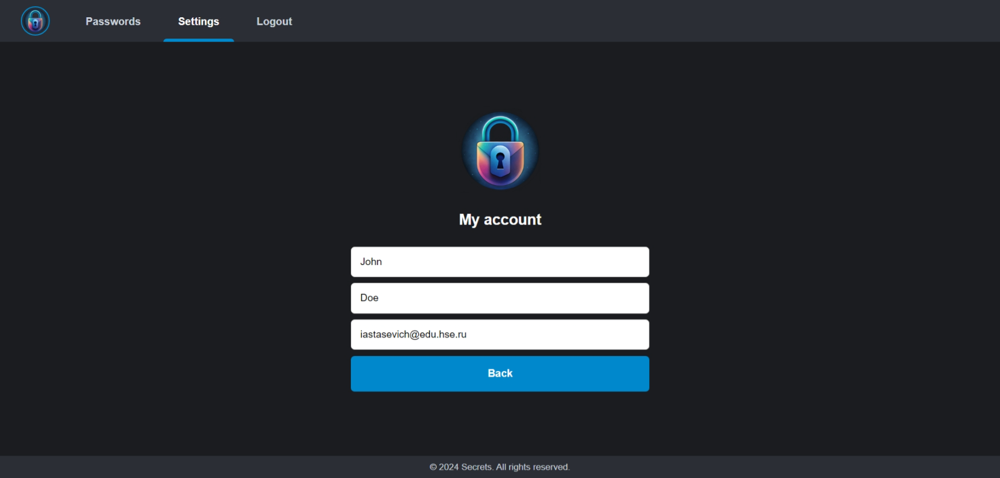

# Secrets — powerful password management

Frontend-часть проекта **Secrets**. Представляет собой сервис для управления пользователями и их паролями.


## Возможности
* Создавайте и управляете паролями из любой точки мира
* Легко находите нужный пароль с помощью поиска
* Защитите пароли надежным AES-шифрованием

## Стек технологий

HTML • CSS • JS • Jinja2 • Python 3.12 • FastAPI

## Сборка

1. Клонируйте репозиторий:

    ```bash
    git clone https://github.com/everysoftware/secrets-frontend
    ```
2. Создайте `.env` файл (используйте `.env.example` как референс) и задайте переменные окружения.

3. Запустите приложение:

```bash
   make up
```

## Скриншоты







**Made with ❤️ by Ivan Stasevich**
